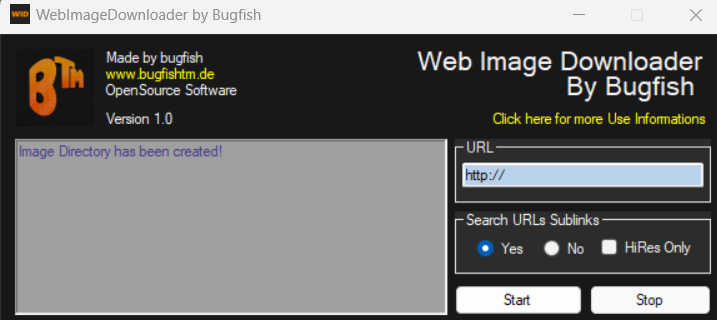

# Bugfish Image Downloader

**Repository:** [Bugfish Image Downloader on GitHub](https://github.com/bugfishtm/bugfish-image-downloader)  
**Documentation:** [Bugfish Image Downloader Documentation](https://bugfishtm.github.io/bugfish-image-downloader/)

*Please note that the comprehensive documentation is available within the "docs" folder of this repository.*

## Overview

Welcome to Bugfish Image Downloader, a versatile software tool designed for downloading images from websites. This utility enables you to input a URL, upon which it will retrieve and save all images found on the specified website. The downloaded images are organized into folders within the application's directory.

### Key Features

- Easily download images from websites of your choice.
- Configure settings to search for images within subsites of the specified website.
- Choose to download only high-definition images with a width of at least 1000 pixels.
- Note: While Bugfish Image Downloader is compatible with many websites, it may not work on all. Feel free to give it a try for your image downloading needs.

## System Requirements

To run Bugfish Image Downloader, you need a Windows operating system with .NET Framework 4.5 installed. The software is designed to run without the need for installation, and it does not write or utilize any registry keys. All folders and files are created in the same location as the executable file.

## Repository Structure

Explore the various folders in the Bugfish Image Downloader repository:

| Folder         | Description                    |
| -------------- | ------------------------------ |
| .github        | Sponsorship information files  |
| _source        | Source code for deployment     |
| docs           | Comprehensive website documentation |
| _releases      | Software release versions      |
| _executable    | Executable versions of the software |

## Support and Assistance

If you encounter any issues or have questions regarding the usage of this software, we encourage you to reach out for assistance. Visit our [Bugfish Forum](www.bugfish.eu/forum) to engage with our community and share your queries. Alternatively, you can request assistance via email at request@bugfish.eu. Our team is committed to providing the best possible support, where available.

## License

Bugfish Image Downloader is distributed under the CC0 1.0 Universal License. For more detailed information, please consult the `license.md` file included with the software.
