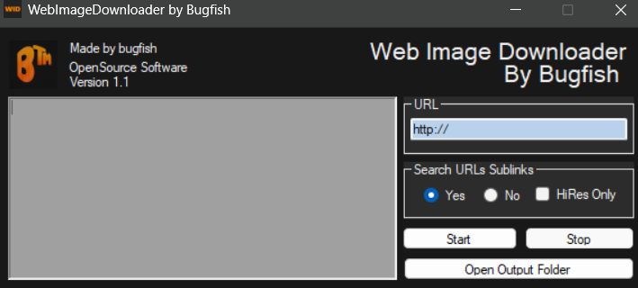

# Bugfish Image Downloader

Effortlessly download images from any website.

-----------

## Introduction

Welcome to Bugfish Image Downloader, a versatile tool designed for downloading images from websites. With this utility, you can input a URL, and it will retrieve and save all images found on the specified website. The downloaded images are neatly organized into folders within the application's directory.

### Key Features

- **Download Images**: Easily download images from websites of your choice.
- **Subsite Search**: Configure settings to search for images within subsites of the specified website.
- **High-Definition Images**: Choose to download only high-definition images with a width of at least 1000 pixels.
- **Compatibility Note**: While Bugfish Image Downloader works with many websites, it may not be compatible with all. Feel free to try it out for your image downloading needs.

### Requirements

To run Bugfish Image Downloader, your system must meet the following requirements:

- **Operating System**: Windows
- **.NET Framework**: Version 4.5 installed

The software is designed to be portable; it runs without installation and does not modify or use any registry keys. All folders and files are created in the same directory as the executable file.

### Usage

1. **Launch the Application**: Open the Bugfish Image Downloader executable file.
2. **Enter URL**: Input the URL of the website from which you want to download images.
3. **Configure Settings**: Adjust settings to specify whether to include subsites or filter for high-definition images.
4. **Start Download**: Begin the download process and monitor progress.
5. **Check Downloaded Images**: Review and organize downloaded images in the application's directory.
-----------

## Screenshots  
Check out our [Screenshots Gallery](./screenshots.html) for a visual overview of the project. You’ll find images showcasing key features and user interface design, offering a preview of what to expect.

-----------

## Downloads  
The [Downloads Section](./download.html) provides all the necessary files to get started with the project, including the latest software versions and any related resources.

-----------

## Contributing  
Find out how you can contribute to the project by visiting the [Contributing Page](./contributing.html). Whether you want to report bugs, suggest features, or submit improvements, we welcome your involvement.

-----------

## Warranty  
Review the terms of our warranty on the [Warranty Information Page](./warranty.html). This page outlines the scope of support and any applicable guarantees.

-----------

## Support  
If you need assistance, visit the [Support Page](./support.html) to find the available channels for getting help with any issues or questions you might have.

-----------

## License  
Get the full details on licensing by checking out the [License Information Page](./license.html). This section includes the terms and conditions under which the project is distributed.