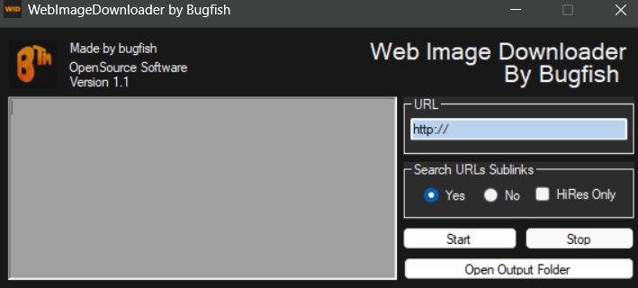

# Bugfish Image Downloader

## Introduction

Welcome to Bugfish Image Downloader, a versatile tool designed for downloading images from websites. With this utility, you can input a URL, and it will retrieve and save all images found on the specified website. The downloaded images are neatly organized into folders within the application's directory.

### Key Features

- **Download Images**: Easily download images from websites of your choice.
- **Subsite Search**: Configure settings to search for images within subsites of the specified website.
- **High-Definition Images**: Choose to download only high-definition images with a width of at least 1000 pixels.
- **Compatibility Note**: While Bugfish Image Downloader works with many websites, it may not be compatible with all. Feel free to try it out for your image downloading needs.

## Requirements

To run Bugfish Image Downloader, your system must meet the following requirements:

- **Operating System**: Windows
- **.NET Framework**: Version 4.5 installed

The software is designed to be portable; it runs without installation and does not modify or use any registry keys. All folders and files are created in the same directory as the executable file.

## Screenshots

Here is a preview of the Bugfish Image Downloader interface:

## Usage

1. **Launch the Application**: Open the Bugfish Image Downloader executable file.
2. **Enter URL**: Input the URL of the website from which you want to download images.
3. **Configure Settings**: Adjust settings to specify whether to include subsites or filter for high-definition images.
4. **Start Download**: Begin the download process and monitor progress.
5. **Check Downloaded Images**: Review and organize downloaded images in the application's directory.
